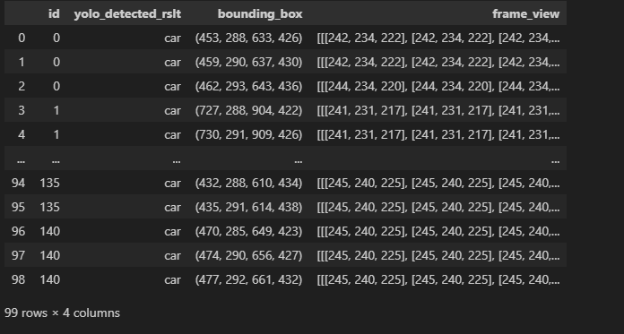
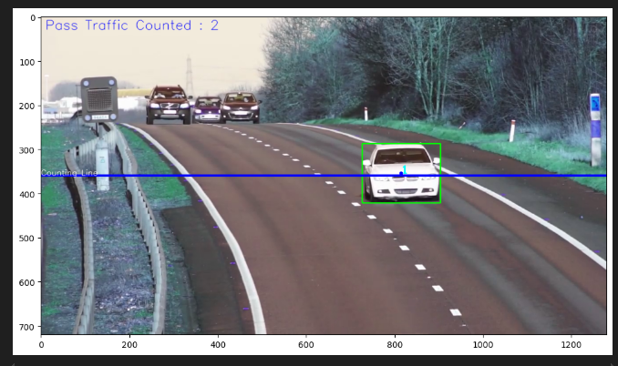

# Traffic Tracking & Counting - Yolov8 & OpenCV

< 교통 유입 차량 감지 >  
Ultralytics의 **YOLO** 및 **OpenCV**를 사용하여 만든 프로젝트입니다. Input으로 들어오는 영상에서 차량을 (Car, Motorcycle, Bus, Truck 등...) 종류별로 구분하여 포착하고, Output으로 분석된 영상(.mp4) 및 데이터 (.csv) 파일들로 반환합니다.

이 프로젝트는 한 방향(One-Way)으로 이동되는 차량 및 유입량을 분석하기 위해 개발되었습니다. 양 방향으로 Tracking & Counting을 하기 위해선 Ultralytics Documents를 참고하시기 바랍니다.

 

## Output Examples:

<!-- <video src="./output_samples/sample_output1.mov" controls> </video> -->
<video src="./output_samples/sample_output1.mov" controls></video>

 

Output Video Link (YouTube) :
1.  https://youtu.be/ly3hR3rU3KY
2.  https://youtu.be/Gsxn5fVR4pU

 

>Output 결과는 'video_detection_results' 폴더에 저장됩니다 (.mp4 & .csv)

 

## Installation
올바른 딥러닝 환경세팅을 위해 Pytorch 및 CUDA 버전을 사용될 컴퓨터/서버에 맞게 설치하시기 바랍니다.

 

**1. Requirements & Use:**
1. OS: Windows 11 (테스트된 환경) 
2. Python Version 3.10.0 설치
3. requirements.txt 필요/담긴 라이브러리 설치
4. 메인 디렉토리 이동 및 CMD 실행
5. CMD:
    - python main.py [비디오 경로]
    - python main.py ./video_data/test_video2.mp4

 

**2. GPU Used:**
- NVIDIA GeForce RTX 3080 Ti Laptop GPU (16GB)
  - Minimum 6GB GPU Memory recomanded
  - Minimum 16GB RAM recomanded

 

## Additional Use:
예시로 사용된 샘플 영상같이, 한 방향으로(One-way load) 유입되는 차량 영상 분석을 위해 프로그래밍 되어있습니다. 영상이 양 방향으로 유입되는 차량을 감지해야 하는 상황이라면 main.py 파일의 Detection/Condition Line을 수정이 필요합니다. (혹은 Ultralytics Document를 참고)

 

DataFrame Output:

 

Detection Frame Output:

 

## 비고:
추후, 고화질 실시간 영상을 Input으로 하여 '차량번호판' 인식 딥러닝 모델을 추가하여, OCR을 진행할 수 있으며, 실제 거리를 알 수 있다면 차량의 속도또한 확인 가능하며, 차량의 종류를 학습시켜 실시간 정교한 교통정보를 확인할 수 있습니다. (오픈소스로 개발 및 유지보수 가능)
 
Video Data :  https://www.pexels.com/search/videos/traffic%20vehicles/